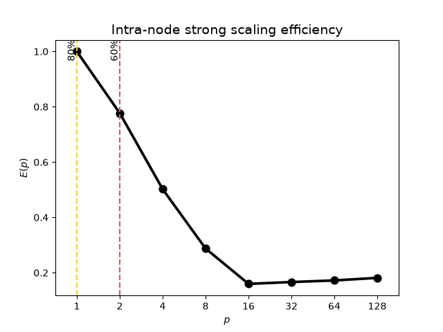
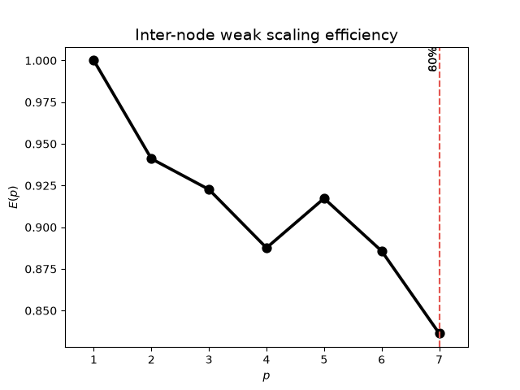
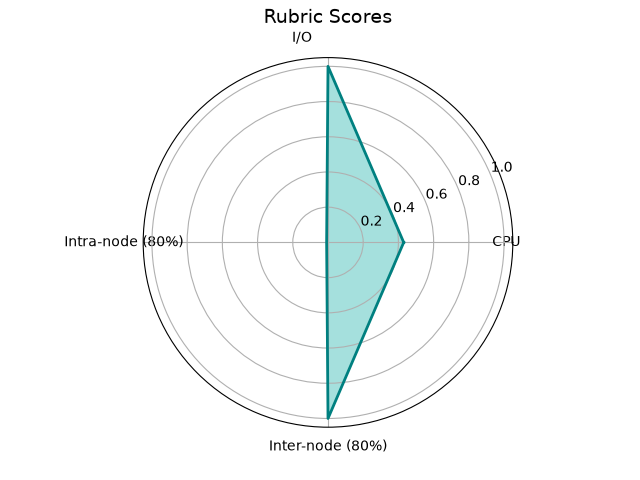

# High-level performance assessment report of `x3d2`

As per the conclusions of the [pre-assessment]("pre-assessment-report-CPU.md"), the high-level assessment was performed by Ananya Gangopadhyay between the 1st and 21st of September 2026.

 The submitter had specified that out of the five performance dimensions, the ones relevant to this assessment and benchmark are:

- [x] [Core-level assessment](#core-level-assessment)
- [x] [Intra-node assessment](#intra-node-assessment)
- [x] [Inter-node assessment](#inter-node-assessment)
- [ ] [GPU/accelerator assessment](#gpu-assessment)
- [x] [I/O assessment](#io-assessment)

## Setup Details

As the code was [successfully compiled on Hamilton](pre-assessment-report-CPU.md/#2-description-of-working-environment) during the pre-assessment, the system was used for the high-level assessment as well using the setup, compilers and modules described [there](pre-assessment-report-CPU.md/#3-compiler-setup-and-optimisations).

### Programming model

The compiled code uses a hybrid MPI and OpenMP model for both intra-node and inter-node runs. The submitter indicated several options for configuring the MPI ranks and threads without any specific preference. We noted that for MPI-only runs, where the number of MPI ranks matches the number of cores, the runs ended in segmentation faults:

```bash
Caught signal 11 (Segmentation fault: address not mapped to object at address $(ADDRESS)
```

We opted to assign one MPI rank per NUMA domain. With 8 NUMA domains per node, MPI ranks were assigned for every 16 cores. For example, for runs with 32 cores, 2 ranks were assigned, and for 128 cores, 8 ranks were assigned, with 16 threads per rank for both cases.

### SLURM configuration

All analyses were performed on an exclusive node on Hamilton with 64 GB memory regardless of the number of MPI ranks or OpenMP threads used. For runs on 1 node i.e. 128 core, the configuration is set to:

```bash
#SBATCH --ntasks-per-node=8
#SBATCH --cpus-per-task=16
#SBATCH --mem=64G
#SBATCH --nodes=1
#SBATCH --exclusive
#SBATCH -p multi
#SBATCH --distribution=block:block
```

For intra-node runs, the `--ntasks-per-node` and `--cpus-per-task` values are set to the number of MPI ranks and OpenMP threads respectively. For inter-node runs, the `--nodes` value is varied.

### Base input

The following is the input configuration used for serial runs:

```txt
&domain_settings  
! Flow case  
flow_case_name = 'tgv'  
  
! Global number of cells in each direction  
L_global = 6.283185307179586d0, 6.283185307179586d0, 6.283185307179586d0  
  
! Global domain dimensions  
dims_global = 256, 256, 256  
  
! Domain decomposition in each direction  
nproc_dir = 1, 1, 1  
  
! BC options are 'periodic' | 'neumann' | 'dirichlet'  
BC_x = 'periodic', 'periodic'  
BC_y = 'periodic', 'periodic'  
BC_z = 'periodic', 'periodic'  
/End  
  
&solver_params  
Re = 1600d0  
time_intg = 'AB3' ! 'AB[1-4]' | 'RK[1-4]'  
dt = 0.001d0  
n_iters = 1000  
n_output = 100  
poisson_solver_type = 'FFT' ! 'FFT' | 'CG'  
der1st_scheme = 'compact6'  
der2nd_scheme = 'compact6' ! 'compact6' | 'compact6-hyperviscous'  
interpl_scheme = 'classic' ! 'classic' | 'optimised' | 'aggressive'  
stagder_scheme = 'compact6'  
/End
```

For parallel runs, the `nproc_dir` parameter was set to match the number of MPI ranks used. For consistency, the default 1D decomposition in the $z$-direction was employed (as indicated by the code when incorrect settings were used) in the form `1, 1, n_ranks`.

The problem size was varied with the `dims_global` parameter. The submitter has indicated that doubling the size in each direction increases the problem size by 8.

## Core-level assessment

For a high-level analysis of a single core's performance, we look for the floating-point operation rate compared to the theoretical rate, $R^{core}_{theoretical}$ for a core. The hardware capabilities were determined with `likwid-bench` pinned to a single core on the first socket of a node:

```bash
likwid-bench -t peakflops -w S0:16kB:1
```

To analyse the performance of a single core, the code was run on one rank and thread with `likwid-perfctr` to get the observed floating point rate, with the [serial input indicated earlier](#base-input):

```bash
likwid-perfctr -f -C 0 -g FLOPS_DP mpirun build-omp/xcompact serial.x3d
```

Despite running on a single core, the job was given access to an exclusive node with all cores and 64 GB memory available to it. In the absence of a dedicated serial configuration, a single MPI rank (and 1 thread per rank) configuration was used.

The observed and theoretical floating point rates were

|       Metric              | MFLOPS    |
| ------------------------- | --------- |
| $R^{core}_{theoretrical}$ | $8886.43$ |
| $R^{core}_{observed}$     | $3832.79$ |

Based on these results, we determined that this software has a score of $C^{core} = \frac{R_{observed}}{R_{theoretical}}\approx$ 0.4312. As the metric is under 0.6, this indicates the core compute performance is _poor_.

## Intra-node assessment

For a high-level analysis of the intra-node performance, we perform a strong scaling by fixing the problem size and increasing core allocation. For this code, we tested with core counts in powers of 2 from 1 to 128 over a complete node. The `dims_global` remained as indicated in the [base input](#base-input), while the `nproc_dir` was varied when changing the MPI ranks.

| Cores | Ranks | Thread per rank | Time (s)     | Parallel efficiency (%) |
| ----- | ----- | --------------- | ------------ | ----------------------- |
| 1     | 1     | 1               | 7100.00      | 1.00                    |
| 2     | 1     | 2               | 4568.00      | 0.77                    |
| 4     | 1     | 4               | 3534.70      | 0.50                    |
| 8     | 1     | 8               | 3085.68      | 0.29                    |
| 16    | 1     | 16              | 2776.57      | 0.16                    |
| 32    | 2     | 16              | 1333.27      | 0.18                    |
| 64    | 4     | 16              | 644.21       | 0.17                    |
| 128   | 8     | 16              | 305.74       | 0.18                    |



The 80\% threshold is at 1 core and the 60% threshold is at 2 cores. As a proportion of the number of cores available on the node i.e. 128, the scores are:

$$
C^{80\%}_{intra}=\frac{p^{80\%}_{critical,intra(Hybrid)}}{p_{max,intra(Hybrid)}}=\frac{1}{128}=0.78125\%
$$
and
$$
C^{60\%}_{intra}=\frac{p^{60\%}_{critical,intra(OpenMP)}}{p_{max,intra(OpenMP)}}=\frac{2}{128}=1.5625\%
$$

With both metrics well below 60%, the shared memory scaling is determined to be _poor_.

## Inter-node assessment

The inter-node performance is measured using a combination of strong and weak scaling analyses. For a given problem size, a strong scaling analysis is performed over increasing node counts, with the parallel efficiency computed with respect to the performance on a single node. When the efficiency drops below 60%, the problem size is increased relative to the initial size. The run is repeated with the new size for that node count, and the strong scaling analysis is continued over the remaining node counts. The step is repeated every time the efficiency falls below 60%.

For the initial problem size on one node, `dims_global` was set to `512, 512, 512`. The runs were configured to have 8 MPI ranks per node (1 per NUMA domain) and 16 threads per rank. The total number of ranks used is `num_ranks_per_node x num_nodes`, which is used to set the `nproc_dir` parameter.

| Nodes | Ranks | Threads per rank | Time (s) | Parallel efficiency (%) |
| ----- | ----- | ---------------- | -------- | ----------------------- |
| 1     | 8     | 16               | 2781.01  | 1                       |
| 2     | 16    | 16               | 1477.58  | 0.94                    |
| 3     | 24    | 16               | 1004.73  | 0.92                    |
| 4     | 32    | 16               | 783.27   | 0.89                    |
| 5     | 40    | 16               | 606.35   | 0.92                    |
| 6     | 48    | 16               | 523.3    | 0.89                    |
| 7     | 56    | 16               | 475.06   | 0.84                    |



For 1 to 7 nodes on Hamilton, the performance never fell under 60%. As a result, the problem size did not require any increase. The metric, $C^{80\%}_{inter}$ was therefore 100%, and the inter-node performance was determined to be _good_.

## GPU Assessment

As of 21/09/2026, the build of the code for GPU deployment was unsuccessful. As a result, the GPU assessment was not performed at this time.

## I/O Assessment

For the I/O performance, we look for the proportion of the runtime spent processing I/O requests. On Hamilton, the I/O performance was determined with the `darshan` tool. The code was run on 128 cores (1 node) with 8 ranks and 16 threads per rank. To obtain the I/O metrics from `darshan`, the following configurations were used:

```shell
module load gcc openmpi darshan
export DARSHAN_DIR=/apps/developers/tools/darshan/3.3.1/1/gcc-11.2-openmpi-4.1.1/
export DARSHAN_LOGDIR=darshan_logs
LD_PRELOAD=${DARSHAN_DIR}/lib/libdarshan.so mpirun build-omp/xcompact one-node.x3d
```

The following relevant I/O metrics were extracted from the `darshan` logs:

| Metric                     | Time(s)  |
| -------------------------- | -------- |
| `total_POSIX_F_READ_TIME`  | 0.000664 |
| `total_POSIX_F_WRITE_TIME` | 0.001117 |
| `total_POSIX_F_META_TIME`  | 0.013111 |

The I/O score, $C_{I/O}$, was computed as follows:

$$
C_{I/O}=1.0-\frac{t_{read} + t_{write}}{t_{total}}=\frac{0.000664 + 0.001117}{7093.95}=1 - 2.51058890561e-07 \approx 0.999999748941 \approx 1.00
$$

With a score above 0.8, the I/O metric is determined to be _good_, with minimal impact on the runtime.

## Summary

The following table collates the results of all above sections. These scores are indicative only, and cannot truly be compared to one another meaningfully without taking into account domain knowledge and methodological differences between them.

| Result | Score | Metric result |
| ---------------- | - | - |
| CPU | 0.43 | 3832.79 MFLOPS |
| GPU | - | - |
| I/O | 1.00 | 2.51 $\times$ 10<sup>-7</sup> |
| Intra-node (80%) | 1.78 $\times$ 10<sup>-2</sup> | 1 core |
| Inter-node (80%) | 1.00 | 7 nodes |



## High-level assessment outcome

Based on the scores assigned, the [core compute performance](#core-level-assessment) and the [intra-node performance](#intra-node-assessment) require attention. We note that the varying the `nproc_dir` parameter, or the assignment of MPI ranks and OpenMP threads may have a meaningful impact on the performance. While their assessment is out-of-scope for the high-level assessment, their analysis should be included in lower-level assessments.
